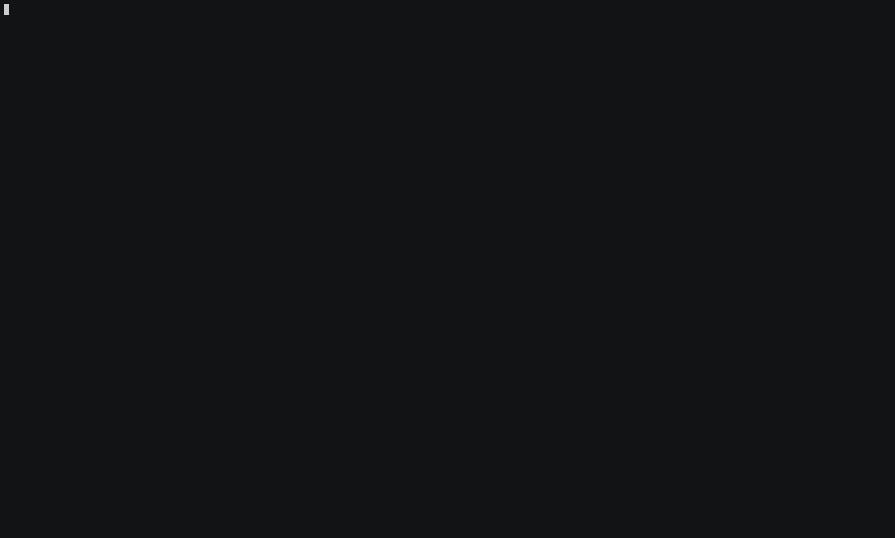
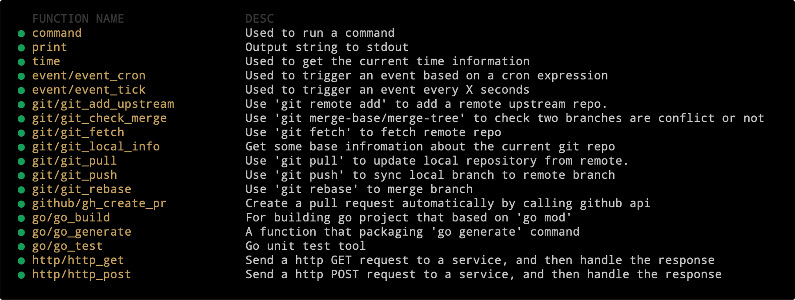

CoFx 是一个自动化引擎，用低代码编程的方式构建个人自动化工作流，让一切无聊的事情都代码化、自动化的被解决。CoFx 框架引擎由编程语言和标准功能函数库两部分组成。



## 安装及配置
目前，暂时还没有提供一个安装包，不过你可以通过自己构建源代码的方式去试用。

源码构建执行一下命令：
```
make first
```

## CLI
```go
// cofx -h

A powerful automation workflow engine based on low code programming language

Environment variables:
  COFX_HOME=<path of a directory>           // Default $HOME/.cofx

Examples:
  cofx
  cofx list
  cofx run  helloworld.flowl
  cofx run  helloworld
  cofx run  fc5e038d38a57032085441e7fe7010b0

Usage:
  cofx [flags]
  cofx [command]

Available Commands:
  completion  Generate the autocompletion script for the specified shell
  help        Help about any command
  list        List all flows that you coded in the flow source directory
  log         View the execution log of the function
  prun        Prettily run a flowl
  run         Run a flowl
  std         List all functions in the standard library or show the manifest of a function

Flags:
  -h, --help   help for cofx
```

## FlowL
Flowl 是一门小语言，专用于函数编织； 语法非常少，也非常简单。目前已经支持函数 load，函数配置 fn，函数运行、变量定义和运算、字符串嵌入变量、for 循环、switch 条件语句等。

### Hello World
helloworld.flowl 代码内容：
```go
// cat examples/helloworld.flowl

load "go:print"

var a = "hello world!!!"

co print {
    "_" : "$(a)"
}
```

运行代码：


flowl 代码文件需要使用 `.flowl` 扩展后缀才能够被执行。

### 语法介绍
#### 注释
使用 `//` 添加代码注释。:warning: 注意，只提供独占行的注释，不能行尾注释。

#### load
load 用于加载一个函数，例如：加载打印函数 print

```go
// go 是函数驱动，表示 print 这个函数是一段 Go 代码，需要用 go 驱动来运行
// print 是函数名
load go:print
```

所有函数在使用前，都需要先 load。

#### 变量 var
`var` 关键字可以定义一个变量，:warning: 注意：变量本身是没有类型的，但内置默认区分处理字符串和数字，数字变量能够进行算术运算

```go
var a = "Hello World!"
// $(a) 表示对变量 a 进行取值
var b = $(a)
var c = (1 + 1) * 2
var d = $(c) * 2
``` 

> `var` 只能够在 global、fn 作用域里使用

`<-` 操作符用于变量重写 （其他语言里一般叫赋值）

```go
var a = "foo"
a <- "bar"
// <- 重写变量后，a 变量的值就变成了 bar
```

> `<-` 能够在 global、fn、for 作用域里使用

#### fn
fn 配置一个函数，配置函数运行时需要的参数等，比如：

```go
// t 是函数别名
// time 是真实函数名
fn t = time {
    args = {
        "format": "YYYY-MM-DD hh:mm:ss"
    }
}
``` 

args 是一个内置的函数配置项，代表函数运行时传给函数的参数，函数参数固定类型为 string-to-string KVs， 对应 Go 语言就是 map[string]string，其他语言同理。:warning: 注意：每一个函数接收的参数 KV 都不一样，需要查看函数的具体用法。

> * 在 `fn` 定义中，函数别名和真实函数名不能够相同
> * `fn` 只能使用在 全局作用域 内 

#### co
co 取自于 coroutine 的前缀，也比较类似于 Go 语言的 go 关键字。co 关键是启动运行一个函数。比如：使用 co 运行 print 函数，输出 Hello World!

```go
fn p = print {
    args = {
         "_" : "Hello World!" 
    }
}

co p
```

关于函数参数，上面的例子 函数p 中，采用了 `fn + args` 给函数传入参数；除了在 fn 中使用 args 传入参数以外，还可以直接在 co 语句中给函数传入参数，如下：

```go
fn p = print {
}

co p {
    "_": "Hello World!"
}
```

:warning: 注意：交给 co 执行的函数，并不一定都需要通过 fn 先定义（fn 的目的主要是通过配置的方式，改变函数的默认运行行为），如下：

```go
// 此处的 print 就不是 fn 定义出来的函数别名，而是真实的函数名
co print {
    "_": "Hello World!"
}
```

关于函数执行的返回值，函数的返回值和函数的参数一样，都是 string-to-string 的 KVs 结构，也就是说每个函数都会将自己的返回值存放到一个类似 map[string]string 的结构中。

一个获取函数返回值的例子：
```go
// 定一个 out 变量，去接收返回值
var out
// '->' 操作符表示函数的返回，所以此处可以认为 out 是一个类似 map[string]string 的变量（实际并不是）
co time -> out

co print {
    // $(out.now) 就是取值 out KVs 中，key 为 now 的值(now 是 time 函数返回值的一个 kv)
    "_": "$(out.now)"
}
```

一个 flowl 源码文件中可以组合使用多个 function，因此 co 提供串行和并行执行多个 function 的能力。

```go
// 串行执行
co funciton1
co function2
co function3
```

```go
// 并行执行
co {
    function1
    function2
    function3
}
```

```go
// 串并行混合
co function1
co {
    function2
    function3
}
```

> `co` 只能使用在 全局作用域, for 作用域，switch 作用域 内 

#### switch 条件选择

`switch + case` 可以根据条件选择执行 `co`，一个 case 语句包含一个条件表达式和一个 co 语句，如下有两个 case 的 switch 语句：

```go
switch { 
	case $(build) == "true" { 
		co print {
			"go build": "starting to run ..."
		}
	}
	case $(test) == "true" {
		co print {
			"go test": "starting to run ..."
		}
	}
}
```

:warning: 注意：switch 中的 case 条件只要为真，就会被执行，也就是说一次可能会执行多条 case 语句，甚至是全部执行；并不是匹配一个 case 为真后就停止。

> `switch` 能够在 global、for 作用域里使用

#### event 
`event` 语句用来定义事件触发器，当触发器产生事件后，就会触发整个 flowl 被执行。
```go
event {
    co event_tick -> ev {
        "duration": "10s"
    }
    co event_cron -> ev {
        "expr": "*/5 * * * * *"
    }
}
```

event 语句里，就是使用 co 语句启动一个或者多个事件函数，它们将会一直等待事件发生。

#### for 循环
`for` 语句在 flowl 适用的场景里面，理论上来说使用频率不会太高。在 一条 Flow 中，我们可以使用 `for` 语句去控制一个函数重复执行多次.

一个带条件的 for 例子：
```go
var counter = 0

for $(counter) < 10 {
    // 计数器 counter 累加 1
    counter <- $(counter) + 1

    // 打印 counter 的值
    co print {
        "_": "$(counter)"
    }

    // 执行函数 sleep，默认 sleep 1s
    co sleep
}
```

for 语句也可以不带条件表达式，实现无限循环，如下：
```go
for {

}
```

## 标准函数库



TODOs:
-  git
-  github
-  HTTP Request
-  MySQL
-  PostgreSQL
-  Redis
-  DingTalk
-  Wechat
-  Slack
- ...

## TODOs
Driver
* 支持 Javascript driver
* 支持 Rust driver
* 支持 Docker driver
* 支持 Kubernetes driver
* ...

工具
* 函数开发架手架
* cofx-server
* repository

## 架构设计

<div align=center></div>

### 核心概念

<div align=center></div>

cofx 架构设计中有 4 个核心概念，分别是 `Flow`, `Node`, `Driver` 和 `Function`

* Flow 就是用一个 `.flowl` 文件编写、定义的一条流
* Node 就是组成一条 Flow 的实体，实际执行、管理 Function 的对象
* Driver 是位于底层真正执行 Function 代码的地方，它定义了一个 Function 如何开发，如何运行，在哪里运行等等；比如：当我们需要增加 Rust 语言来开发 Function，那么就需要先实现一个 Rust 的 Driver
* Function 就是真正的函数了，它可以是一个 Go package 代码、一个二进制程序、一个 shell 脚本，或者一个 Docker 镜像等等

### flowl

<div align=center></div>

flowl 采用词法和语法分离的实现方式，再语法分析完成得出一颗 AST 树后，再将 AST 转换成函数的运行队列，基于运行队列就可以按序执行函数

## 开发贡献
TODO:
